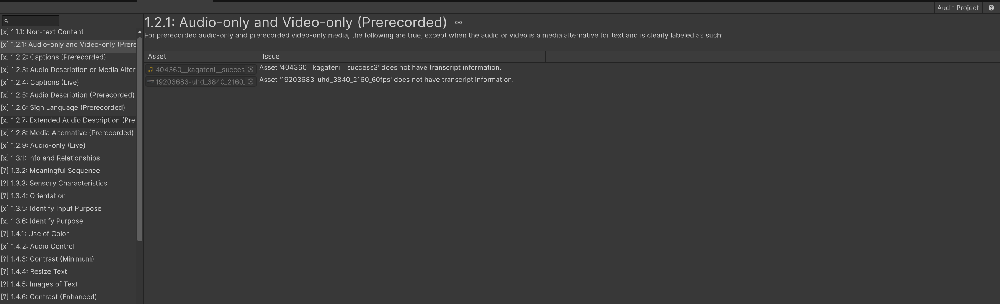

# Easy Accessibility (Unity)
Easy Accessibility is an open-source Unity package that brings WCAG compliance tooling to Unity. It provides ready-to-use implementations, an automated auditor, and an extensible framework so developers can ship accessible Unity applications without starting from scratch.

# Motivation
Users (especially in enterprise use cases) are eager to have accessible software. While web and mobile software has boundless amounts of support toward this, 3D software has more limited and fragmented documentation.

This project hopes to provide a foundation of standard implementations developers can use 'off the shelf', develop their own, or replicate in their own project of choice.

# Features
* **(🧪 Testing) Auditor:** audits your project for common accessibility issues and offers recommendations for correcting them
	* Status: Auditor currently works. UI needs polished and remaining implementations below are stubbed and need to be finished.
* **(🧪 Testing) Colorblind Filters:** provides a colorblindness correction filter to the entire project. Colorblindness correction and simulation features are available for URP, HDRP, and Built-In Render Pipelines.
	* Status: Implementations exist and are working. Need to polish up integration approach (ex: offer a button to automatically enable).
* **(🔨 In-Progress) Rebindable Keys:** offer a codeless integration for rebindable keys. Includes support for loading/saving/resetting keybinds.
	* Status: Initial work on setting up structure, as well as evaluation for non-rebindable keys (Roslyn).
* **(📓 Planned) Animation Settings:** setting to control animations on a page (ex: UI animations).
* **(📓 Planned) Audio Controls:** functionality for providing audio controls, such as pausing a cutscene.
* **(📓 Planned) Custom Fonts:** a suite of fonts to help with disabilities (ex: dyslexia).
* **(📓 Planned) Cutscene Gaps:** procedurally provide gaps cutscenes where extended/descriptive audio can catch up its description.
* **(📓 Planned) Descriptive Audio:** system for listening for all in-game audio and generating dynamic captions (ex: bird chirps).
* **(📓 Planned) Disability Simulator:** a tool for simulating various forms of disabilities (ex: colorblindness, deafness/minimal sound, low visibility).
* **(📓 Planned) Flickering Content:** setting for controlling flashing content.
* **(📓 Planned) Focus Order:** high-level focus order manager
* **(📓 Planned) Footage Review:** tool for evaluating game footage and looking for issues (ex: contrast).
* **(📓 Planned) High Contrast Mode:** offer the ability to have objects shaded in high contrast.
* **(📓 Planned) Keywords:** mechanism for identifying definitions of words or phrases (ex: underline for a Unit in an RTS with a description of the unit).
* **(📓 Planned) Leveled Text:** setting for adjusting the reading level of content (where applicable).
* **(📓 Planned) Page Titler:** titling of the page activity (primarily for WebGL).
* **(📓 Planned) Param-Based Navigation:** system for providing param-based navigation to access states of the game (ex: going to a specific page in the UI).
* **(📓 Planned) Phobia Modes:** settings for replacing material based on phobia settings (ex: arachnophobia).
* **(📓 Planned) Pronunciation:** built-in tool for how to pronounce a word.
* **(📓 Planned) Quick-Time Event (QTE) Extensions:** system for programmatically extending quick-time events for those with timing difficulty.
* **(📓 Planned) Screen Reader:** exposes game context in a screen reader-supportable format.
* **(📓 Planned) Sign Language:** translation system for either expressing audio as a set of signing symbols or as an animated avatar signing the information.
* **(📓 Planned) Transcript:** provide a transcript of the audio being played, typically in a cutscene.
* **(📓 Planned) VPAT Generation:** generates a Voluntary Product Accessibility Template (VPAT) based on the Auditor results (a requirement for most enterprise use cases).
* **(📓 Planned) Supporting Materials:** materials to help understand WCAG requirements, implementation approaches, and how to utilize the project. Some planned components:
	* Example projects, showcasing all functionality
	* UI design language for the project
	* Tutorial videos
	* Supporting documentation, including discussion of implementation approaches
# Installation/Usage
## Getting Started
### Demo Project
1. Download and open the project
2. From the toolbar, select **Window > Easy Accessibility > Auditor**
3. Either explore the window for correctable issues, or select **Audit Project** in the top-right to start a fresh audit

4. Explore the TestObjects folder for examples of how to utilize the different features
### Package
1. Download the a-la-code.easyaccessibility package to your Unity project
2. From the toolbar, select **Window > Easy Accessibility > Auditor**
3. Select **Audit Project** and explore the window for identified issues

# Contributing
Contributions are welcome! While core architecture is still being established, feel free to open issues for feature requests, bug reports, or implementation suggestions. Pull requests for the planned features above are encouraged.
# Roadmap
* **(🔨 In-Progress) Phase 1:** core auditor, colorblindness filters, rebindable keys
* **(📓 Planned) Phase 2:** expanded feature support
* **(📓 Planned) Phase 3:** supporting materials, community contributions, VPAT generation
# License
The project is licensed under an MIT License